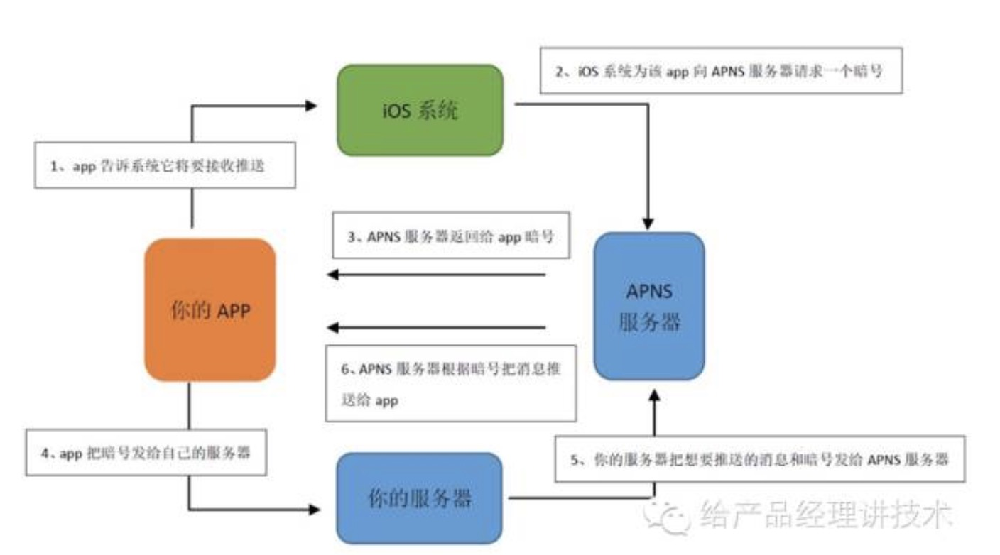
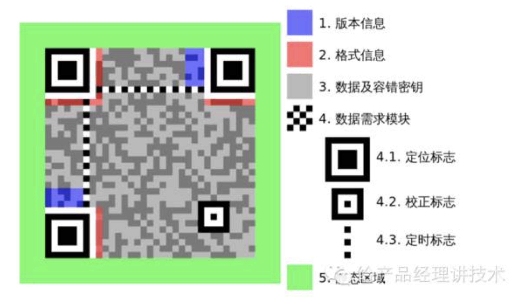

##APP推送服务
```
server和app建立一个长时间链接的通道，用于相互通信，如何维持这个链接呢？
app每隔一段时间嫌烦server报告自己还活着；
一般手机锁屏后，cpu会休眠，但是发送心跳会唤醒cpu,必然增加电量消耗，多个app推送更加严重；
在android和ios上分别使用GCM和apns解决；
以apns为例，ios开通了一条系统级别的长y连接通道，通道的一端是手机的所有app,另一端是苹果的服务器。
app的服务器如果有消息推送，先把消息发到苹果的服务器上，再利用苹果的服务器通过长连接通道发送到用户手机，然后通知具体的app;
这样就做到了即使手机安装了100个app,也只需向一条通道发送心跳；
android中，系统提供的GCM在2.2以上才能用，3.0以下必须安装Google Play且登录google账户才支持；
```

###android应用复活
```
kill掉的应用汇自己复活？
法1.监听系统事件
Android系统有一套广播机制，当系统发生了某件事的时候，它会通知给需要知道这件事情的所有应用。比如说，用户切换了网络，系统就拿出一个高音喇叭吼到：“各单位注意了，系统网络切换了，现在是3G网络了”，这个时候，一个正在做下载任务的应用收到了这个通知，它就会考虑一下，为了给用户省流，那就暂停下载吧。这套机制对于良心应用来说，就是可以根据系统当前的状态，给用户带来更好体验。但是，对于某些别有用心的应用，它就利用这套机制，钻个小空子了，明明用户已经退出它了，它仍旧把自己唤醒，静静地躺在后台。
法2.守护进程唤醒
有的ROM会对这些广播进行限制，于是就有了进阶版，守护进程方案。很多应用在启动后，还会创建一个守护进程，守护进程就是一个小的魔法师，跑在后台不断的检查大哥进程还在不在，一旦大哥进程被杀死了，它就默默地施法，把大哥复活。
法3.全家桶系列
守护进程也有一个局限，那就是你首先得通过其它方式启动一次。这时就该放出终极大招了，全家桶系列。它的原理很简单，就是不同应用之间相互唤醒，当应用A被杀死后，同门兄弟B就会将它唤醒复活，还有的情况是只要你启动了A，它就会把它的同门兄弟ABCD都唤醒了。 

```

###手机反应慢原因
```
IOS系统的响应顺序依次为Touch–Media–Service–Core架构，换句话说当用户只要触摸接触了屏幕之后，系统就会最优先去处理屏幕显示也就是Touch这个层级，然后才是媒体(Media)，服务(Service)以及Core架构。而Android系统的优先级响应层级则是Application–Framework–Library–Kernal架构，当你触摸屏幕之后Android系统首先会激活应用，框架然后才是屏幕最后是核心架构。
```

###app更新提示原理
```
android:
AndroidManifest.xml文件中package=包名。android:versionName=版本号；
以小米商店为例，
1.商店软件会提取用户手机上所有已安装文件的包名和对应版本号；
2.通过网络协议将上述取得的数据上报到小米商店软件的后台服务器；
3.后台服务器在当前上架的apk中查找比现在安装版本高的相同包名的apk;
4.将查到的apk数据返回给手机中的小米商店，更新提示；
ios只有对应的版本名于市场中的app版本名不同，就判断可以更新；
```


###代理服务器
```
1.手机浏览器省流加速的原理是通过代理服务器，拿到原始内容后，进行一些数据压缩操作；
```

###二维码
```
它是由固定信息＋自定义信息两个部分组成，固定信息包括了四个角上的定位标志、格式信息、版本信息，这些信息的作用是辅助扫码软件确定二维码的位置和规格，其余的就是我们需要传达的自定义信息了。当我们要传递的信息量越大时，二维码的尺寸也会随之变大，标准的二维码是有40种尺寸的，官方以Version开头，最小的Version1是一个21x21大小的矩行，最大的Version40是177x177大小的矩形。这里有个小技巧，如果你想推广的URL特别长，会导致二维码比较大，这时可以使用一个短网址服务(如t.cn)，将URL缩短一些，这样基本上Version1大小的二维码就可以搞定，用户扫描起来也会更快更准～

数据是怎样存在二维码上的呢？当我们要制作一个URL的二维码时，首先要将它编码转换成为类似0101的二进制码，然后还要补上一些纠错码，最后根据一定的顺序，将这些0101的二进制码，变成黑白两种颜色块画出来。
这里要细说一下纠错码。在识别二维码时会出一些小错，有的点块会判断出错，比如把黑色认成了白色，也有的点会被挡住，比如大家经常在二维码中间放一个Logo，这样信息就出现了缺失。这部分缺失的信息，我们可以从纠错码中还原回来，纠错码有LMQH四种级别，分别表示有7%、15%、25％和30%的信息即便是丢失了，也可以从纠错码中还原回来。所有如果你想让二维码信息准确识别成功，最好在生成二维码时，将纠错级别设为H。

你可能注意到了，信息到二维码之间的转换，就是01和黑白的色块之间的转换，通常使用黑白色，是因为它们的区分度最大，识别率更高。当然，并不是一定要用黑白二色，只要将二维码中对应的区块做的有一定区分度，扫码软件仍然可以将信息完整的解析出来。

```

### 渐进式图片
```
普通jpeg图片的压缩方式是采用从左至右、从上到下逐行压缩的，而渐进式jpeg图片的压缩方式是根据小波变换，先存储低频（轮廓）内容，然后再存储高频（细节）内容，
这样在拉取图片的过程中，就是一个逐渐清晰的过程。如果要针对移动网络的场景优化流量，还可以只下载渐进式图片的一部分，以达到降低图像分辨率和减少流量的目的。

渐进式图片这么牛逼，为什么这些网站和App不怎么使用呢？原因主要有两个，一是现有图片大多是普通格式压缩的，需要转换成为渐进式格式，有一定的成本，另一个原因就是终端的支持程度不够，现在还有一些落后的浏览器（如IE8）对渐进式格式的支持较弱。不过随着时间推移，这部分浏览器会逐渐被淘汰，所以果果觉得，以后渐进式图片会越来越流行的。
```